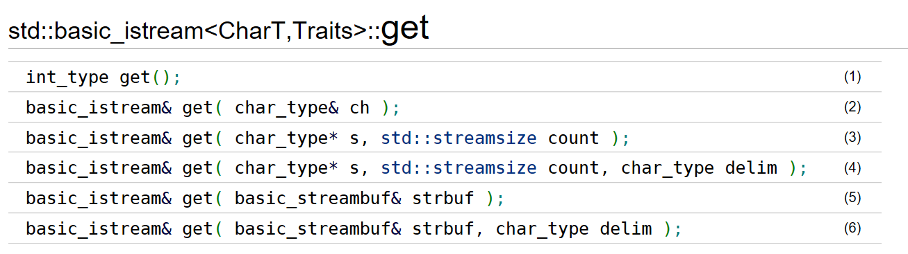
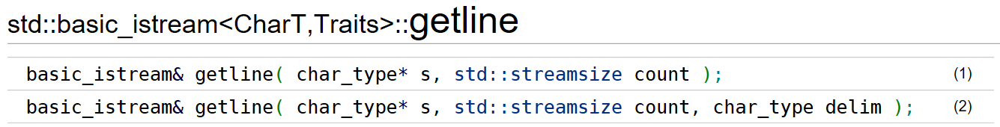
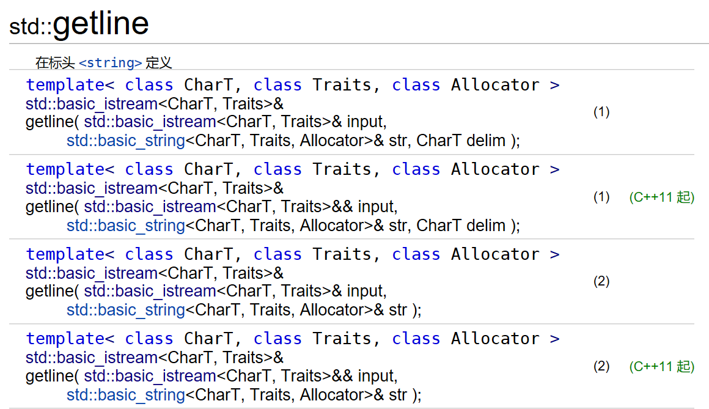
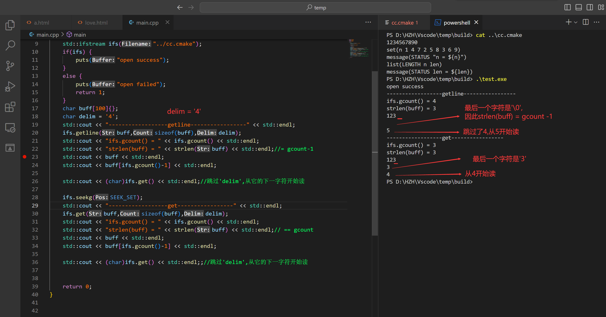

# std::basic_istream::get

用于读取输入流的 `std::basic_istream::get` 函数

`std::istream::get`、 `std::ifstream::get`、 `std::istrstream::get`、 `std::iostream::get`、 `std::fstream::get`、 `std::strstream::get`



**get函数的终止条件如下：**

- 读到`eof`：以上所有函数当读到流的结尾触发`end of file`条件时，会执行`setstate(eofbit)`。
- 读到`delim`：(3)(4)(5)(6)当将要读取的下一个字符`c == delim`时，get会将已读取到的字符串存储并从流中释放，但字符`c`并不会被释放。如果继续读取，第一个读取到的字符就是`c`
- 读满`s`：(3)(4)至多读取`count-1`个字符存储至字符串`s`中，因为最后一个字符是`\0`。
- 没读到：如果没有读出任何字符，会执行`setstate(failbit)`。

> ​	**注意：**
>
> ​	由于get默认的`delim`是`'\n'`，使得在读文件时的行为表现出来就是读取一行的内容，但它又不会将`'\n'`读出并释放，这也是容易与getline造成混淆之处。


# std::basic_istream::getline

​	**C++中有两种getline函数：**一种是`std::basic_istream::getline`，它与上文的get函数都是`istream`类的成员函数；另一种是`std::getline`，定义于头文件`<string>`中，是`std`命名空间的全局函数。



**getline函数的终止条件如下：**

- 读到流的结尾，会执行`setstate(eofbit)`；
- 读到`delim`：当下一个字符`c == delim`，字符`c`会被读取并释放，但不会被存储到s中，下一次读取将跳过这个字符；
- 已经读取了`count-1`个字符，会执行`setstate(failbit)`；
- 如果没有读出任何字符（e.g.`count < 1`），会执行`setstate(failbit)`。

> 默认`delim`为`\n`


# std::getline

`std::getline`的功能是从一个输入流中读取字符串，然后存储到一个`string`中.




# 避坑

## 1. gcount()的返回值



> ​	**getline按行读取，`gcount()`会返回真正的字符数+1，+1是补了一个`\0`，所以发送数据时一定要注意**
>
> ​	get 则不会出现这种情况，因为get遇到定界符`delim`，不会读走它

```c++
std::ifstream ifs("../cc.cmake");
if(ifs) {
    puts("open success");
}
else {
    puts("open failed");
    return 1;
}
char buff[100]{};
char delim = '4';
std::cout << "------------------getline-----------------" << std::endl;
ifs.getline(buff,sizeof(buff),delim);
std::cout << "ifs.gcount() = " << ifs.gcount() << std::endl;
std::cout << "strlen(buff) = " << strlen(buff) << std::endl;//= gcount-1
std::cout << buff << std::endl;
std::cout << buff[ifs.gcount()-1] << std::endl;

std::cout << (char)ifs.get() << std::endl;//跳过'delim',从它的下一字符开始读

ifs.seekg(SEEK_SET);
std::cout << "------------------get-----------------" << std::endl;
ifs.get(buff,sizeof(buff),delim);
std::cout << "ifs.gcount() = " << ifs.gcount() << std::endl;
std::cout << "strlen(buff) = " << strlen(buff) << std::endl;// == gcount
std::cout << buff << std::endl;
std::cout << buff[ifs.gcount()-1] << std::endl;

std::cout << (char)ifs.get() << std::endl;;//跳过'delim',从它的下一字符开始读
```


## 2.get()返回-1

如果已经到末尾再get:返回-1,并设置failbit和eofbit
