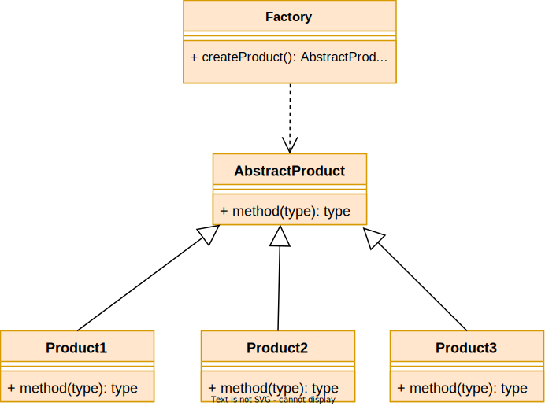
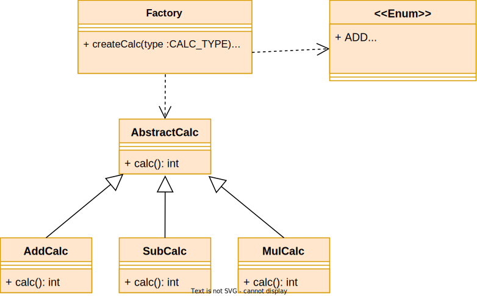
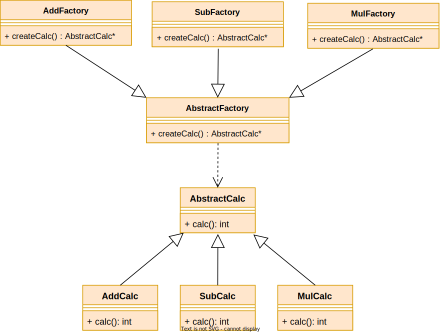
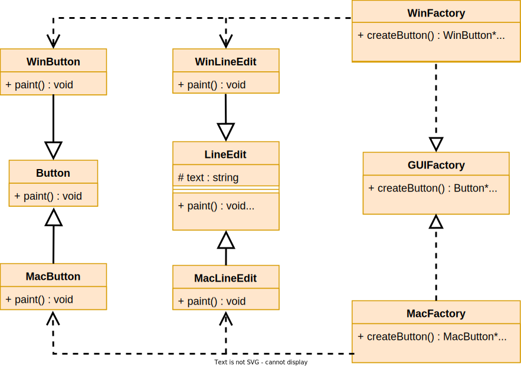

# 创建型模式

## 单例模式

> 一个类只能一个实例对象,并提供全局访问

- **禁止在类外创建对象**
  - 私有化构造函数, 删除拷贝赋值函数
- **类自己维护其唯一对象**
  - 静态成员变量

- **提供访问单例对象的方法**
  - 静态成员函数

[饿汉式](./Singleton/Singleton1.cpp):

- 优点
  - 实现简单,访问效率高	
  - 多线程访问单例对象安全
- 缺点
  - 单例对象一直存在,浪费内存

[懒汉式](./Singleton/Singleton2.cpp):

- 优点
  - 随用随创建,节省内存
- 缺点
  - 创建销毁浪费时间
  - [多线程访问单例对象不安全](./Singleton/Singleton2_multhread.cpp)

> 使用**静态局部变量**解决线程同步: 如果指令逻辑进入一个**未被初始化的声明变量**，所有并发执行应当**等待**该变量完成初始化。

## 简单工厂模式

一个工厂, 根据传入产品类型创建不同产品

[Example](./SimpleFactory/SimpleFactory.cpp): 计算器V1.0

**拓展产品种类不符合开闭原则:** 拓展新产品, 必须修改工厂类的生产函数switch, 不符合闭原则

## 工厂模式

n个工厂实现, 每个工厂负责生产一种产品 

**拓展产品符合开闭原则**: 拓展新产品只需添加一个抽象工厂的实现, 无需修改抽象工厂类代码

[Example](./FactoryMethod/FactoryMethod.cpp): 计算机V2.0

 

## 抽象工厂

n个工厂, 每个工厂实现生产多种产品, 但每个工厂生产的产品风格/系列不同

对拓展产品风格/系列符合开闭原则, 对拓展产品种类不符合开闭原则

[Example](./AbstractFactory/AbstractFactory.cpp): GUIFactory

​	GUIFactory工厂生产Button和LineEdit产品, 不同的工厂生产不同的产品风格

