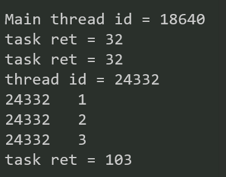

[第 7 章 并行与并发 现代 C++ 教程: 高速上手 C++ 11/14/17/20 - Modern C++ Tutorial: C++ 11/14/17/20 On the Fly (changkun.de)](https://changkun.de/modern-cpp/zh-cn/07-thread/)

## 线程返回值

异步和同步

## :one: std::async

```c++
template<class Fn, class... Args>
future<typename result_of<Fn(Args...)>::type> async(launch policy, Fn&& fn, Args&&...args);
```

> ​	功能：
>
> ​	第二个参数接收一个可调用对象（仿函数、lambda表达式、类成员函数、普通函数...）作为参数,并且异步或是同步执行他们。

a、对于是异步执行还是同步执行，由第一个参数的执行策略决定：

（1）、**std::launch::async** 传递的可调用对象**异步执行**；

（2）、**std::launch::deferred** 传递的可调用对象**同步执行**；

（3）、std::launch::async | std::launch::deferred 可以异步或是同步，取决于操作系统，我们无法控制；

（4）、如果我们不指定策略，则相当于（3）。

### std::launch::deferred

- 不调用get（）、wait（）不执行入口函数
- 延迟调用 不会创建线程

### std::launch::async

- 调用std::async()时就创建线程


## :two: std::future<>

- **std::async 、 std::packaged_task 或 std::promise 能提供一个std::future对象给该异步操作的创建者**
- 可移动

### 成员函数

#### get()

​	如果结果状态为has_result状态,获取返回值线程返回值(只能调一次)，否则阻塞，结果为pending状态，调用之后结果为empty状态

#### wait()

​	阻塞直至结果变得可用

#### share()

​	转移给shared_future<>

#### valid()

​	future里是否有result，即是否可以共享转为shared_future，**get() shar()之后为false**

## std::shared_future<>

- 多个线程访问同一共享状态是安全的，可以多次get()

## :three: std::packaged_task<>

**将一个可调用对象封装起来，然后可以将其的返回值传给future**

​	可以绑定一个可调用对象(普通函数、lambda、仿函数、bind表达式)创建一个任务，通过get_future获取future来获取任务返回值。

- **不可拷贝 可移动**

### 成员函数

#### valid()

​	检查任务对象是否拥有合法函数

#### operator()

​	执行函数

#### get_future()

​	获取future

#### reset()

​	重置状态，抛弃先前执行的结果，reset()后可重新获取future。

### Example:

```c++
int test_thread(int value)
{
	std::cout << "thread id = " << std::this_thread::get_id() << std::endl;
	int wait = 3;
	for (int i = 0; i < 3; i++) {
		std::this_thread::sleep_for(std::chrono::duration<long long>(1));
		value++;
		std::cout << std::this_thread::get_id() << "\t" << i + 1 << std::endl;
	}
	return value;
}

int MyPow(int x, int y) { return std::pow(x, y); }

void task_bind()
{
	std::packaged_task<int(int,int)> task(std::bind(MyPow,std::placeholders::_1, std::placeholders::_2));
	task(2,5);//返回值为void
	std::cout << "task ret = " << task.get_future().get() << std::endl;
}

void task_func()
{
	std::packaged_task<int(int, int)> task(MyPow);
	task(2, 5);//返回值为void
	std::cout << "task ret = " << task.get_future().get() << std::endl;
}

void task_thread()
{
	std::packaged_task<int(int)> task(test_thread);
	std::future<int> ret = task.get_future();
	std::thread(std::move(task), 100).join();//move
	std::cout << "task ret = " << ret.get() << std::endl;

	//std::thread(std::ref(task), 100).join();//ref
	//std::cout << "task ret = " << task.get_future().get() << std::endl;
}

int main()
{
	Base line;
	std::cout << "Main thread id = " << std::this_thread::get_id() << std::endl;
	task_bind();
	task_func();
	task_thread();

	return 0;
}
```




## :four: std::promise

#### set_value()

#### get_future()